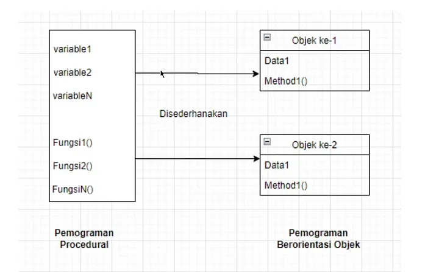

# H1
## H2
### H3
#### H4
##### H5
###### H6

line

---

Normal text

untuk link
1. [Hello World](helloworld/README.md)
2. [Medium](https://iakurniadev.medium.com/)


link2 https://iakurniadev.medium.com/
petik satu `petik satu`

dropdown
* 1
* 2
* 3

- test1
  - test2
  * test3
- test4

*italic*

**bold**

***italic bold***

image link
 

source code
```java
public class Main {
    public static void main(String[] args) {
        System.out.println("Hello world");
    }
}
```
Output
```
Output terminal
Hello world
```
`kutip satu`
> Note `kutip satu` dan `kutip satu lainnya`