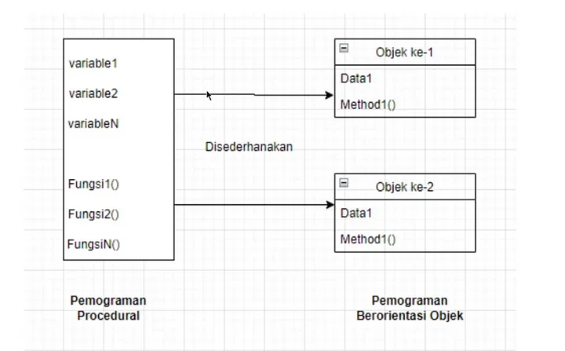
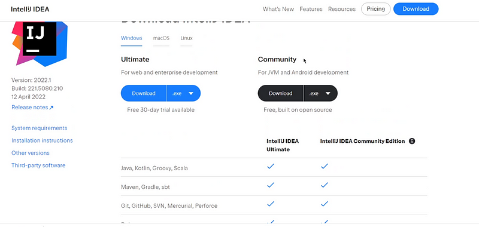

# Chapter 1. Pengenalan Java

---

Pada chapter ini kita akan membahas
- Apa itu *Java* dan Mengapa harus *Java*?
- Program di dalam Java *(bytecode)*.
- Perbedaan pemograman procedural dan berorientasi objek.
- *Software* yang dibutuhkan.
- Instalasi *software*.
- Setting *Classpath*.
- Membuat program **Helloworld**.
- Cara Kompilasi dan Eksekusi program secara manual.
- JAVA IDE menggunakan Intelij IDEA.
- Elemen-elemen dasar dalam bahasa *Java*.
- Konsep Pemograman Berorientasi Objek.
    
Pada chapter ini akan membahas pengetahuan dasar mengenai *java* yang dimana bertujuan untuk bekal dalam mempelajari materi materi yang akan di bahas pada chapter chapter selanjutnya.
Pada chapter ini kita bisa dengan benar memahami konsep program yang terdapat di dalam java seperti bagaimana cara membuat program java, konsep kompilasi dan cara instalasi softwarenya.
Dan pada chapter ini juga akan di jelasakan mengenai konsep pemograman yang berorientasi objek.

## Apa itu *java* dan mengapa harus *java*.
Java adalah bahasa pemograman yang berorientasi pada objek yang di buat oleh James Gosling.


Bahasa pemograman java mirip dengan bahasa pemograman C/C++, Karena java dirancang secara umum bahasa yang berbasis pada suatu objek atau sering disebut OOP (Object Oriented Programming).

Sejarah singkatnya java itu pada tahun 1991 ada pembangunan mengenai projek pengembangan java yang di lakukan oleh **James Gosling**, **Mike Sherida**, dan **Patrick Naughton**. Awalnya projek tersebut dinamakan Oak, itu di ambil dari nama pohon yang berada di depan rumahnya **James Gosling**, setelah itu tidak lama berubah lagi menjadi *Green*, dan pada akhirnya berubah lagi dengan nama ***java***.

Nama ***java*** ini di ambil dari asal usul kopi yang diminumnya pada saat mengerjakan projek tersebut yakni **pulau jawa**. Oleh sebab itu logo icon java itu sampai sekarang berbentuk seperti secangkir kopi.


## Mengapa Harus Java?
Mungkin dari teman-teman punya alasan tersendiri dan berbeda dengan yang lainnya.

Tapi jika dari teman teman ada yang belum tahu mengapa kita harus belajar java, saya akan berikan beberapa alasan yang mungkin bisa membuat teman teman lebih tertarik untuk belajar bahasa pemograman java.
* Java Bersifat General Purpose
  Maksud dari java itu bersifat general purpose, karena dengan Java, kita tidak hanya membuat program yang spesifik saja, tetapi kita bisa membuat program baik itu dekstop, web, android dan lain sebagainya.
  Bisa dianalogikan java itu sebagai kunci inggris yang bisa membuka baut dan mur dengan berbagai ukuran. 
* Java itu Cross Platform
  Seperti yang dijelaskan sebelumnya, java itu sering di sebut dengan istilah "once write, run anywhere" yang artinya bisa dijalankan di semua platform, selama platform tersebut memiliki JVM.
* Java Itu Populer
  Java itu banyak di cari banyak perusahaan, berdasarkan data dari hasil pencarian dari salah satu web yaitu TIOBE Programing Comunity Index, dari beberapa tahun kebelakang sampai saat ini java adalah bahasa pemograman terpopuler

    

## Program di dalam Java *(bytecode)*.
Bahasa pemograman java menerapkan dua proses yaitu ***compiler*** dan ***interpreter***. Maksudnya, umumnya dalam semua bahasa pemograman, sebuah kode program itu akan di kompilasi (*compiler*) kemudian di terjemahkan (*interpreter*) agar kode program tersebut bisa dijalankan pada sebuah komputer. Software yang digunakan untuk melakukan kompilasi kode program disebut sebagai *compiler*, dan software yang digunakan untuk melakukan interpretasi atau menerjemahkan kode program itu disebut sebagai *interpreter*.

Jadi java berperan sebagai *compiler* dan juga sebagai *interpreter*.

Mungkin untuk awal awal teman teman mungkin masih bingung, tapi tidak apa-apa jika teman-teman masih bingung, saya akan buatkan gambarannya secara sederhana.


Perhatikan gambar di atas mengenai **"proses eksekusi program didalam java"**. Semua kode program yang di tulis dengan menggunakan bahasa pemograman java pasti filenya akan berekstensi **.java** maka file kode program tersebut akan di kompilasi oleh *compiler* sehingga menjadi sebuah kode objek. Kode objek tersebut dalam java disebut dengan istilah ***bytecode***. Jadi hasil akhir dari kode program itu akan berupa ***bytecode*** dan berektensi ***.class***. Dengan demikian proses *compiler* hanya akan dieksekusi sekali ketika program tersebut pertama kali dijalankan, tetapi proses *interpreter* akan selalu dijalankan setiap kode program itu dieksekusi.

Bytecode sering diartikan sebagai sekumpulan perintah dalam bahasa mesin untuk sebuah JVM (*Java Virtual Machine*). Program yang dibuat dengan menggunakan bahasa pemograman java tidak mungkin dapat dijalankan didalam komputer yang tidak memiliki JVM.

Dengan adanya konsep *bytecode* ini, Java sering dikenal dengan istilah *"write once, run anywhere"*. Artinya ketika kita menulis kode program dengan bahasa pemograman java dan melakukan *compiler* terhadap kode program tersebut, maka *bytecode* nya dapat dijalankan di *platform* manapun selama *platform* tersebut memiliki JVM.

## Perbedaan pemograman procedural dan berorientasi objek.
Dalam sebuah kode program yang terdapat didalam sebuah komputer itu terdiri dari kode dan data. Kode disini maksudnya adalah sebuah fungsi dan data adalah sebuah variable. Selanjutnya kode dan data tersebut di atur sedemikian rupa sehingga dapat menghasilkan program sesuai dengan yang di inginkan.

Pada bahasa pemograman tradisional atau sering disebut **procedural**, semua kode dan data itu digabung menjadi satu dalam satu program. Ini tidak akan terjadi masalah jika kita membuat kode program yang masih sederhana, dimana kode program nya hanya membutuhkan beberapa baris kode saja, tetapi ini akan bermasalah ketika kita membuat sebuah program yang besar atau kompleks yang mungkin membutuhkan ratusan bahkan ribuan baris kode. Maka dari itulah alasan inilah yang menciptakan bahasa pemograman yang berorientasi pada objek. Pada model inilah kode program tersebut akan di susun menjadi beberapa bagian tersendiri yang di sebut sebagai **objek**.

Berikut ilustari gambar perbedaan pemograman procedural dan pemograman berorientasi pada objek atau sering di sebut dengan **OOP** ***(object Oriented Programing)***.



Seperti yang teman teman lihat pada gambar di atas, dalam pemograman berorientasi objek, setiap objek akan memiliki *data* (sifat berupa variabel) dan *method* (perilaku atau fungsi). Jadi objek bisa didefinisikan sebagai suatu entitas yang memiliki *data* dan *method*.

Sebagai contoh manusia adalah sebuah objek, dimana setiap manusia itu memiliki *data* yang berbeda antara manusia satu dengan yang lainnya seperti nama, jenis kelamin, tinggi badan, berat badan dan yang lainnya, serta manusia juga memiliki *method* atau fungsi yang berbeda beda seperti cara berbicara, cara marah, cara berjalan dan sebagainya.

Berikut gambaran ilustrasinya.


Dalam bahasa pemograman, objek semacam ini ***(Manusia)*** di abstraksikan sebagai sebuah **kelas**. Dengan kata lain **kelas** adalah bentuk abstrak dari suatu objek atau sering disebut dengan ***Blueprint***, dan wujud nyata dari suatu kelas disebut dengan **instance**.

Kita akan ambil contoh, apabila terdapat sebuah kelas Manusia maka instance nya itu adalah Jaka, Wawan, Andri dan yang lainnya. Contoh lain apabila terdapat kelas Kucing maka instance-nya adalah si hitam, si manis, si puspus dan yang lainnya.

Secara umum beberapa keuntungan yang bisa kita ambil dari pemograman berorientasi objek adalah
* objek objeknya dapat digunakan ulang (*reusable*).
* kode programnya lebih terstruktur dan lebih mudah untuk dikembangkan.
* bersifat natural dan alami,dimana objek yang ada pada program tersebut disesuaika dengan objek dalam kehidupan sekitar kita.

## *Software* yang dibutuhkan.
Untuk membuat kode program menggunakan bahasa java, maka teman teman minimal membutuhkan dua software.
1. JDK (Java Development Kit)
   Seperti dijelaskan diatas, karena java dikenal dengan istilah "once write, run anywhere" maka dengan menginstal JDK ini maka secara otomatis JVM (*Java Virtual Machine*) sudah terinstall dengan JRE nya (*Java Runtime Exception*) maka kode program yang dibuat dengan java dapat berjalan di platform yang sudah terinstal JDK.
2. Text Editor
   Untuk text editor ini ada bebepa yang bisa digunakan untuk pemograman java, seperti :
   - Notepad / Notepad ++ 
   - Eclipse 
   - Netbeans 
   - Intelij IDEA
     
   Bagi teman teman bebas memilih dan menggunakan text editor apa saja sesuai dengan yang teman teman inginkan, tetapi dalam artikel ini kita akan sering menggunakan text editor Intelij IDEA.

## Instalasi *software*.
### Bagaimana cara download JDK dan Intelij IDEA?
Untuk download **jdk** teman teman bisa search aja keyword nya ***download jdk latest version*** atau bisa ke link ini [download jdk](https://www.oracle.com/id/java/technologies/downloads/). Maka tampilannya akan seperti di bawah ini.
> *Karena saat membuat pembahasan ini, ketika download jdk latest versi nya masih versi jdk 18, bisa jadi sekarang ketika teman teman download jdk latest version nya bisa lebih tinggi dari yang di jelaskan disini. Teman teman tinggal menyesuaikan saja.*


Teman teman bisa download sesuai dengan OS masing masing, karena saya pakai windows, maka saya akan jelaskan cara download windows. Teman teman bisa download link yang ***compressed archive*** atau yang ***installer***. Tenang saja di pembahasan ini saya akan jelaskan bagaimana cara **Instalasi JDK Archive** dengan extract file dan **Instalasi JDK dengan file jar**.

Apa teman teman sudah download jdknya? kalo sudah mari kita lanjutkan lagi pembahasannya :D

### Instalasi JDK Archive ?
Untuk setting jdk archive ini cukup mudah, karena ini bersifat portable teman teman cukup ekstrack file nya di path direktory yang di inginkan. Maka tampilannya akan seperti gambar di bawah ini.

> *ini path folder saya set path nya di* **"C:\JAVA"**. *Teman teman bisa menyesuaikan pathnya*.


Jika kita lihat lebih detail di folder **jdk-18** maka akan seperti gambar di bawah ini.


Sudah deh sudah selesai cara instal jdk dengan archive file…..
Cukup mudah kan, cuma extact file saja di folder yang di inginkan:D

###Instalasi JDK dengan file jar?
Setelah teman teman selesai download, maka file nya akan seperti ini.


Setelah itu kemudian teman teman install saja seperti biasanya.
Adapun langkah langkah instalasi nya seperti berikut ini:
* Double klik file jar tersebut sehingga muncul gambar seperti ini

    

* Kemudian klik next, maka akan muncul seperti gambar di bawah ini

    

* Karena ini file instalasi maka default path ini mengarah ke path `C:\Program Files\Java\jdk-18`, teman teman bisa rubah path folder nya sesuai dengan path yang teman teman inginkan, saran saya karena ini file instalasi maka path foldernya dibuat default saja tidak perlu di rubah. Setelah itu lalu klik next lagi maka proses instalasi sedang berjalan, seperti pada gambar dibawah ini.

    

* Tunggu sampai proses nya selesai. Jika sudah selesai maka akan muncul seperti gambar dibawah ini.

    

Nah teman teman bisa cek kembali path folder yang tadi kita arahin saat instalasinya. Karena disini saya mengarah ke path folder `"C:\Program Files\Java\jdk-18"`, maka tampilannya akan seperti gambar di bawah ini.


Jika teman teman bandingkan dengan file instalasi ataupun yang archive hasilnya sama saja. Tetapi bedanya jika teman teman menggunakan cara instalasi maka file yang sudah kita install akan masuk list file yang sudah terinstal di komputer/laptop teman teman, seperti gambar dibawah ini.


jadi teman teman bisa pilih cara mana yang diinginkan sesuai dengan pilihan kalian mau cara yang instalasi atau file archive bebas toh hasilnya sama saja.
###Instalasi Intelij IDEA.
Nah setelah teman teman install jdknya, kita lanjutkan untuk menginstal Text Editor yang akan digunakan. Disini saya akan menggunakan Intelij Idea bagian dari product jetbrains teman teman bisa download di link ini [**download here**](https://www.jetbrains.com/idea/download/?section=windows). Maka akan muncul seperti gambar berikut.



Nah teman teman bisa pilih yang ultimate atau comunity. Biasanya kalo ultimate itu berbayar tpi ada free trial nya sedangkan comunity itu yang free. Perbedaannya teman teman bisa baca dari document jetbrainnya, tpi perbedaannya biasanya feature yang ada di comunity tidak selengkap dengan feature yang ada di ultimate. Tapi tenang saja teman teman, untuk saat ini kita lebih dari cukup untuk menggunakan yang versi comunity saja. Jadi silahkan download dulu dan install ya. installnya cukup mudah cuma next next doang ngga ada yang ribet sih.

setelah ini kita akan lanjut bahas cara setting classpathnya.
## Setting *Classpath*.
Mengapa sih kita harus seting juga classpath dan apa fungsinya terus kenapa kalo kita tidak seting classpath, mungkin itu pertanyaan pertanyaan yang ada di benak kalian, mari kita bahas lebih detail.

***Classpath*** adalah suatu variabel sistem yang digunakan untuk mengatakan kepada program yang ditulis dengan java dimana tempat lokasi kelas-kelas yang akan digunakan. Dengan melakukan ***setting*** terhadap nilai variable ***classpath***, maka kita dapat melakukan compile atau eksekusi program java yang di buat di path direktori kita. Misal, kita akan membuat program java di path folder **programJava** di direktori **D:** misal, apabila terdaat pesan error pada saat compile terhadap program program java yang terdapat di direktori tersebut, maka kita perlu melakukan setting terhadap variable classpath dengan perintah **"set CLASSPATH=D:\programJava"**.

Atau apabila teman teman ingin agar proses compile dan eksekusi program javanya dapat dilakukan dari direktori manapun maka tambahkan direktory bin yang terdapat pada path folder jdk yang kita install contohnya:
> ***set PATH= C:\Program Files\Java\jdk-18\bin;%PATH%***

> ***set CLASSPATH=D:\programJava***

Mari kita setting untuk classpath nya.

Teman teman ketikan saja environment variable di windows kalian seperti gambar berikut.


Setelah itu klik saja edit environment maka akan muncul tampilan seperti


Lalu klik saja environment variable yang ada di bawah maka akan muncul gambar seperti ini


Nah disana ada 2 variable 1 untuk user variable 1 lagi untuk system variabel. Bedanya kalo system itu global tetapi kalo user itu misal dari teman teman ada beberapa user dan teman teman cuma pengen seting di user1 doang, jadi lebih ke spesifik usernya.

Disini kita akan seting di system variable saja biar global, maka teman teman tinggal tambah saja dengan klik new maka akan muncul gambar seperti ini.


Nah variable name nya diisi dengan **"JAVA_HOME"** dan value variable nya kita dengan path jdk yang tadi kita install sebelumnya **"C:\Program Files\Java\jdk-18"** lalu klik saja ok maka akan bertambah system variable nya seperti dibawah ini.


Lalu kita jangan lupa untuk edit setting variable classpath nya dengan menambahkan  variable **JAVA_HOME** nya. Caranya klik edit pada variable classpath seperti gambar berikut.


maka tambahkan saja variable **JAVA_HOME** nya dan arahkan path nya ke folder bin seperti gambar dibawah ini.


Kalo sudah tinggal klik ok saja dan selesai lah cara setting classpath nya.

untuk memastikan apakah setting path nya sudah selesai atau belum, teman teman cukup tulis perintah ***java -version*** di cmd, jika sukses maka akan muncul seperti berikut.


## Membuat program **Helloworld**.
Sekarang kita akan memulai membuat program java sederhana yaitu program ***helloworld.***

Biar teman teman paham detailnya saya akan menjelaskan cara create programnya dengan notepad/notepad++ baru kita create dengan intelij IDEA nya.

Pertama teman teman buka notepad nya lalu ketikan source code dibawah ini.
```java
public class MyProgram{
 public static void main(String[] args){
  System.out.println("Hello World");
  System.out.println("Saya Suka Pemograman JAVA");
 }
}
```
Setelah itu save file tersebut dan simpan di direktori **C:\MyCodeJava** dan nama file nya harus sama dengan nama class dan ekstensionnya harus.java seperti gambar berikut.


Maka hasilnya akan seperti ini


Kebanyakan bahasa pemograman lain, nama *file* yang berisi kode program dapat disimpan dengan nama file bebas. Namun, dalam *java*, nama *file* harus seama persis dengan nama kelas yang memiliki *method* **main()**. Jadi untuk contoh program diatas, kita harus menyimpan *file* dengan nama **MyProgram.java**.

Sekarang, mari kita bahas lebih detail mengenai kode program diatas, meskipun tampak sedikit atau hanya beberapa baris kode, tetapi program tersebut memiliki beberapa fitur kunci yang umum dan diterapkan pada semua program **java**.

Pertama kita bahas mengenai kode program di bawah ini

*public class MyProgram {*

Baris kode di atas mengguanakan kata kunci **class** dimana fungsinya untuk mendefinisikan sebuah kelas baru dan diikuti dengan nama kelasnya. 

Mengapa perlu mendefinisikan kelas? Karena dalam **java**, semua program adalah kelas. Tanda kurung kurawal buka **{**, digunakan untuk mengawali sebuah blok program, sedangkan tanda kurung kurawal tutup **}** digunakan untuk mengakhiri sebuah blok program. Blok program dapat berupa kelas, *method*, struktur pemilihan, struktur pengulangan dan lain sebagainya. Untuk sementara ini kita tidak akan bahas mengenai kata kunci *public* yang terdapat pada baris kode di atas. Kita akan bahas lebih detailnya pada materi chapter *package* dan *interface*.

Selanjutnya, dalam kelas *MyProgram* terdapat baris kode berikut ini :

*public static void main(String[] args){*

Baris ini akan memulai *method main()*. Method *main()* adalah *method* utama yang pasti dimiliki oleh semua program *java* dan akan dieksekusi pertama kali pada saat program dijalankan. Kata  kunci *public* yang terdapat pada deklarasi *method main()* digunakan untuk menentukan tingkat akses dari method yang bersangkutan. Dengan menyertakan kata kunci *public*, maka *method* tersebut dapat diakses oleh kode luar yang di luar kelas *MyProgram*. Kenapa method main harus bersifat *public*? Hal ini disebabkan karena *method* tersebut akan dipanggil dari luar kelas pada saat program dijalankan. Selain bersifat *public*, *method main()* juga harus dideklarasikan sebagai statis (dengan menggunakan kata kunci *static*). Alasannya, karena *method main()* akan dipanggil oleh *interpreter* **java* tanpa harus melakukan instansiasi terhadap kelas *MyProgram* terlebih dahulu. Apabila teman teman masih merasa bingung dengan penjelasan yang di sampaikan di atas, teman teman tidak perlu merasa cemas karena semua itu akan kita bahas secara detail dalam chapter chapter selanjutnya.

> Sebagai catatan, suatu program java (selain applet) tidak akan dapat dikompilasi apabila tidak memiliki method main()

Baris selanjutnya dari kode di atas yaitu :

*System.out.println("Hello World");*<br>*System.out.println("Saya Suka Pemograman JAVA");*

Kode tersebut digunakan untuk menampilkan teks <br>*"Hello World"*<br>*"Saya Suka Pemograman JAVA"*<br>
kelayar output (dalam hal ini, layar monitor laptop/pc teman teman semua)

Terakhir, kode diatas ditutup dengan tanda kurung kurawal tutup *}*. Tanda tersebut digunakan sebagai bagian akhir dari definisi kelas *MyProgram*.

## Cara Kompilasi dan Eksekusi program secara manual.
Untuk melakukan kompilasi program yang telah kita buat sebelumnya, kita perlu menggunakan perintah *command-line* melalui *command-prompt*
- buka windows lalu ketikan cmd dan tekan enter untuk membuka cmd tersebut seperti gambar di bawah ini

    

- kemudian ketik path direktori file yang kita simpan. karna kita sebelumnya di save di direktori path *C:\MyCodeJava* maka teman teman tinggal arahkan cmd nya ke path tersebut dengan mengetikan *cd C:\MyCodeJava*. terlihat seperti gambar berikut ini

  

- Kemudian lakukan kompilasi terhadap file *MyProgram.java* dengan menggunakan perintah berikut

```shell
javac MyProgram.java
```
Setelah kita jalankan script diatas pada cmd, maka dalam direktori tersebut akan terdapat *file* baru dengan nama *MyProgram.class*. File inilah yang dinamakan dengan *bytecode* dan merupakan *file* akhir dari program yang kita buat. Hasilnya akan seperti gambari berikut ini.


- Setelah kita compile, kita tinggal menjalankan atak mengeksekusi program yang dihasilkan. Tuliskan perintah nya seperti berikut (dalam direktory yang sama seperti sebelumnya) 

```shell
java MyProgram
``` 
Maka hasil outputnya akan seperti ini, sesuai dengan yang kita print pada code yang telah kita buat.


Seperti itulah proses compile dan run secara manual, biar teman teman paham cara kerja compile dan run execute program yang ada dalam bahasa pemograman java.

## JAVA IDE menggunakan Intelij IDEA.
Setelah kita paham cara manual membuat dan mengexecute manual program java. maka kita akan mencoba yang lebih mudah dengan menggunakan tools GUI intellij IDEA.
<br>Cukup mudah caranya,Teman teman tinggal mengikuti langkah-langkah berikut :
- pertama buka intellij IDEA nya di windows teman teman semuanya seperti gambar berikut ini
  


- asd
- 


## Elemen-elemen dasar dalam bahasa *Java*.
Sebelum melangkah ke pembahasan lebih lanjut, terlebih dahulu teman teman harus mengetahui beberapa elemen dasar yang terdapat pada **java**. Elemen-elemen terserbut meliputi : komentar program, block program, *separator* (pemisah), dan kata kunci.

Mari kita bahas untuk lebih detailnya.
- Komentar Program 

    Komentar program adalah bagian dari kode program yang tidak ikut dieksekusi pada saat proses kompilasi program. Ini berarti bahwa kehadiran komentar program tidak akan mempengaruhi jalannya program. Komentar program biasanya digunakan untuk menuliskan informasi-informasi tentang kode program, misalnya: nama pembuat, versi, deskripsi program dan lain-lain. Selain itu, komentar program juga sering digunakan untuk menuliskan alur atau algoritma dari kode program yang ditulis.

    Komentar dalam java di bagi menjadi 3 bagian :
1. Komentar untuk satu baris
    Java menggunakan tanda ***//*** untuk membuat komentar yang hanya berlaku satu baris kode. Berikut contoh penggunaannya.
   ```java
    // ini adalah komentar satu baris dalam bahasa java
    ```
   Apabila tanda `//` diterapkan untuk komentasr yang lebih dari satu baris, maka akan menyebabkan kesalahan pada saat kompilasi program, seperti pada contoh kode program berikut ini
   ```text
    // ini adalah 
       komentar java (salah -> menyebabkan error saat proses compile)
    ```
   pada kode program di atas, baris kedua dianggap sebagai pengenal (*identifier*) yang tidak dikenal sehinggal menimbulkan kesalahan pada proses kompilasi.

2. Komentar untuk beberapa baris
    <br>Dalam java, komentar yang banyaknya lebih dari satu baris dibuat dengan menggunakan tanda `/*` dan `*/`. Berikut ini contoh penggunaanya.
   ```java
   /* ini adalah komentar satu baris */
   /* ini adalah komentar 
   lebih dari dua baris */
    ```
   Seperti yang teman-teman lihat pada contoh diatas, jenis komentar yang menggunakan tanda `/*` dan `*/` juga dapat diterapkan untuk komentar lebih dari satu baris.

3. Komentar untuk keperluan dokumentasi atau sering di sebut java documentation.
    <br> Selain kedua jenis komentar di atas. Java memiliki jenis komentar khusus yang digunakan untuk keperluan dokumentasi, yaitu dengan menggunakan tanda `/**` dan `*/`. Komentar jenis ini akan digunakan oleh program **javadoc** untuk men-generate atau menghasilkan file HTML. Untuk membuatnya, kita juga perlu menggunakan tag-tag khusus yang sudah disediakan, misalnya `@author, @version, @param` dan sebagainya. Kita tidak akan membahas lebih jauh tentang cara pembuatan dokumentasi semacam ini. Namun, sebagai gambaran bagi teman-teman semuanya, berikut ini adalah contoh penggunaan komentar jenis ini di dalam program.
```java
/**
 * Program "Hello world"
 * @author iakurnia
 * @version 1.0
 */
```

- Blok Program
    <br>Java mengizinkan kita untuk mengelompokkan satu atau lebih statement ke dalam sebuah blok program. Dalam java, blok program diawali dengan tanda **{** dan akan diakhiri oleh tanda **}**. Pada saat kita menuliskan sebuah kode program, kita akan banyak bekerja dengan blok program. Dalam java, blok program dapat diterapkan untuk definisi kelas, *method*, struktur pengulanan, struktur pemilihan, dan yang lainnya. Berikut ini contoh pembuatan blok program di dalam java.
```java
/* blok program pada definisi kelas */
class BlokProgram { // bagian awal blok program class
    public static void main(String[] args) { // bagian awal blok prgram method main
        /* blok program pada struktur pengulangan */
        for(int a=0; a<10; a++){ // bagian awal blok prgram for
            System.out.println(a);
        }   // bagian akhir blok prgram for

        int a = 3;
        int b = 5;
        /* blok program pada struktur pemilihan/percabangan */
        if(a < b){   // bagian awal blok program pemilihan/percabangan
            System.out.println("nilai a = "+a+ " lebih kecil dari nilai b yaitu = "+b);
        }   // bagian akhir blok program pemilihan/percabangan
    }   // bagian akhir blok prgram method main

    /* blok program pada definisi method */
    public int getNumber(int number){ // bagian awal blok program method
        return number;
    } // bagian akhir blok program method
}   // bagian akhir blok program class
```
Sebagai catatan, untuk satu buat statemen di dalam blok perngulangan dan pemilihan/percabangan, sebenarnya kita tidak perlu menggunakan blok program. perhatikan contoh berikut
```text
    if(a < b) System.out.println("nilai a = "+a+ " lebih kecil dari nilai b yaitu = "+b);
    
    for(int a=0; a<10; a++)
        System.out.println(a);    
```
Namun, dalam pembahasan disini kita akan menggunakan blok program, meskipun didalamnya hanya terdiri dari satu buah statemen seperti kode program sebelumnya yang menggunakan blok program walaupun dengan satu buat statemen.

- *Separator*
<br>*Separatoefstryr* digunakan untuk memisahkan salah satu bagian dari program dengan bagian lainnya. *Separator* yang paling sering digunakan dalam setiap kode program adalah *semicolon* (tanda titik koma), yang digunakan untuk memisahkan statemen yang satu dengan yang lainnya. Berikut ini daftar *separator* yang terdapat di dalam java.
  
  

- Kata Kunci
<br> Kata kunci adalah kata-kata yang telah didefinisikan oleh *compiler* dan memiliki arti dan tujuan spesifik. Java tidak mengizinkan kita untuk membuat sebuah pengenal (nama variable, konstanta, kelas, maupun method) dengan menggunakan kata kunci. Berikut ini daftar kata kunci yang terdapat di dalam java.
  
  


## Konsep Pemograman Berorientasi Objek.
Pemograman berorientasi objek atau yang lebih lazim dikenal dengan sebutan *Object Oriented Programing* (OOP) adalah inti dari pemograman java. Semua program java merupakan objek. Maka dari itu, sebelum teman teman memulai penulisan kode-kode program java yang terdapat pada chapter chapter selanjutnya, sebaiknya teman teman mengetahui terlebih dahulu dasar-dasar dari konsep yang terkadang dalam pemograman berorientasi objek. Beberapa ciri dari pemograman berorientasi objek adalah abstaksi (*abstraction*), pembungkusan (*enscapsulation*), pewarisan (*inheritance*), dan polimorfism atau kebanyakrupaan (*polymorphism*). Pembahasan detail mengenai setiap ciri OOP tersebut akan kita bahas lebih detail lagi di chapter lain yaitu pada saat kita membahas tentang sebuah *kelas*.


[**back menu**](../../README.md) ***<==>*** [**next chapter2**](../chapter2/README.md)

---
