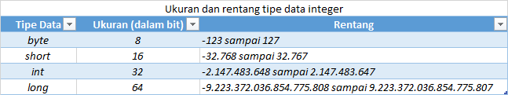
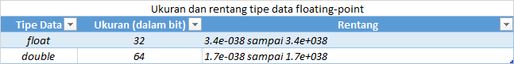
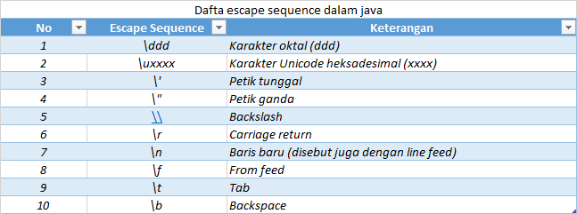
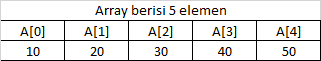
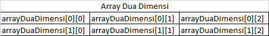

# Chapter 2. Type Data, Variable dan *Array*

---

Pada chapter ini kita akan membahas
- Pengelompokkan Tipe Data dalam Java.
- Variable
- Typecasting
- Array Satu-Dimensi
- Array Dua-Dimensi
- Pengenalan Tipe String dalam java
- Java dan Pointer (Penggunaan dalam Bahasa C/C++).


Pada chapter ini akan membahas mengenai tiga elemen fundamental paling penting dalam pemograman java, yaitu tipe data, variable dan array. Seperti layaknya bahasa pemograman tingkat tinggi lainnya, java juga mendukung beberapa tipe data. Tipe data tersebut selanjutnya dapat digunakan untuk mendeklarasikan variable maupun array yang kita butuhkan dalam program.

## Pengelompokan type data
Java mendefinisikan delapan buah tipe data sederhana yaitu *byte, short, int, long, float, double dan boolean*. Tipe-tipe tersebut kemudian dikelompokan menjadi beberapa bagian yaitu : type *integer* (bilangan bulat), *type floating* (bilangan rill), type *karakter*, dan tipe *boolean* (logika).
* ***Integer*** : Kelompok ini terdiri dari type *byte, short, int, dan long*, yang digunakan untuk merepresentasikan data-data yang bertipe bilangan bulat, misalnya -5, 0, 15, 100 dan sebagainya.
* ***Floating-point***. Kelompok ini terdiri dari tipe *float* dan *double* yang digunakan untuk merepresentasikan data-data yang bertipe bilangan rill (mengandung pecahan), misalnya -12.13, 13.45, 3.14 dan sebagainya.
* ***Karakter***.  Kelompok ini terdiri dari sebuah tipe data yaitu *char*, yang merepresentasikan data dalam bentuk karakter alfanumerik dan simbol, misalnya: 'a', 'B', '7', '$' dan sebagainya.
* ***Boolean***. Kelompok ini juga terdiri dari sebuah tipe data yaitu *boolean* yang digunakan untuk merepresentasikan nilai logika (benar/salah).

Seperti yang telah dikemukakan sebelumnya, tipe tipe sederhana di atas merupakan bentuk dasar dari semua tipe kompleks lainnya, seperti *array* maupun tipe objek yang akan kita bahas lebih detail pada chapter ini.
<br> Tipe sederhana hanya mampu menyimpan nilai tunggal, bukan objek-objek yang berfisat kompleks. Meskipun java mendukung penuh model pemograman berorientasi objek, namun hal ini tidak berlaku untuk tipe-tipe data sederhana. Tipe-tipe tersebut tidak berbeda dengan tipe-tipe sederhana yang terdapat pada kebanyakan bahasa pemograman non-OOP (bahsa yang tidak mendukung model pemograman berorientasi objek).
<br> Bahasa pemograman lain, seperti C dan C++ mengizinkan ukuran *integer* yang berbeda-beda tergantung dari lingkungan eksekusi yang akan digunakan, sedangkan java memiliki konsep yang berbeda. Dalam java, semua tipe data berada pada rentang yang tetap untuk setiap lingkungan/*platform* maupun arsitektur mesin yang berbeda. Sebagai contoh, tipe *int* selalu berukuran *32* bit. Alasannya adalah agar program dapat berjalan di semua *platform* tanpa harus mengubah sedikit pun kode yang terdapat di dalamnya.
### Tipe *Integer* (Bilangan Bulat)
Pada chapter sebelumnya. Teman-teman telah melihat bahwa tipe *integer* dibedakan menjadi empat jenis yaitu *byte, short, int, dan long*. Semua tipe ini bersifat *signed* (bertanda), yaitu tipe data yang dapat merepresentasikan nilai negatif maupun posifit. Tidak seperti kebanyakan bahasa pemograman lain seperti: C dan C++ dan yang lainnya. Java tidak mendukung nilai *unsigned* (tipe tanda baca yaitu tipe data yang hanya dapat menyimpan nilai positif).
<br> Ukuran dan rentang dari tipe data *integer* di dalam java dapat teman teman lihat pada gambar di bawah ini.



#### Tipe *byte
Tipe ini adalah tipe terkecil dari tipe *integer*. Tipe *byte* pada umumnya digunakan pada saat kita bekerja dengan sebuah data *stream* dari suatu *file* maupun jaringan, yaitu untuk keperluan proses membaca/menulis. Selain itu, tipe ini juga digunakan pada saat bekerja dengan data *biner* yang tidak kompatibel dengan tipe-tipe lain yang didefinisikan dalam Java.
<br> Untuk mendeklarasikan variabel bertipe *byte*, kita perlu menggunakan kata kunci *byte*. Berikut ini contoh pendeklarasian tiga buat variable bertype *byte*.
```text
byte a;
byte b, c;
```
Cara pendeklarasian variable di dalam java akan kita kaji secara lebih detail pada chapter selanjutnya.
#### Tipe *short*
Tipe ini merupakan tipe 16 *bit* yang berada pada rentang nilai -32.768 sampai 32.767. Pada umumnya diaplikasikan pada komputer-komputer 16 *bit*, yang saat ini semakin jarang keberadaannya. Berikut ini contoh pendeklarasian variable bertipe *short*.
```text
short s;
```

#### Tipe *int*
Tipe ini adalah tipe yang paling banyak digunakan untuk merepresentasikan nilai *integer* karena dianggap paling efisien dibandingkan dengan tipe-tipe *integer* lainnya. Tipe *int* banyak digunakan untuk indeks dalam struktur pengulangan maupun dalam konstruksi sebuah *array*. Selain itu, secara teori setiap ekspresi yang melibatkan tipe *integer* (*byte, short, int, dan long*) semuanya akan dipromosikan ke tipe *int* terlebih dahulu sebelum proses perhitungan dilakukan. Sebagai contoh, perhatikan kode program berikut ini.

```java
public class PerhitunganTypeInt {
    public static void main(String[] args) {
        byte a = 1;
        short b = 2;
        int c = 3, hasil;
        hasil = a + b + c;
        System.out.println("Hasil : " + hasil);
    }
}
```
Hasil yang akan ditampilkan di layar sebagai berikut :

```
Hasil : 6
```

Di sini, secara internal variabel a = (*byte*) dan b (*short*) akan dipromosikan ke tipe *int* terlebih dahulu sebelum akhirnya operasi perhitungan di atas dilakukan.
#### Tipe *long*
Tipe ini digunakan untuk kasus-kasus tertentu yang nilainya berada di luar rentang tipe *int*. Dengan kata lain, tipe data *long* biasanya terpaksa digunakan pada saat tipe *int* sudah tidak cukup lagi untuk menampungnya. Berikut ini contoh penggunaan tipe data *long* untuk mendeklarasikan sebuah variabel.

```text
long jumlahDetik;
long jarak;
```
### Tipe *Floating-Point* (Bilangan Rill)
Tipe *floating-point* digunakan untuk merepresentasikan nilai-nilai yang mengandung pecahan atau angka desimal di belakang koma, seperti : 3.14, 5.25 dan sebagainya. Bilangan-bilangan semacam ini sering disebut dengan bilangan *rill*. Dalam java, tipe *floating-point* dibedakan menjadi dua jenis, yaitu *float* dan *double*. Contoh kasus sederhana yang menggunakan tipe data ini adalah menghitung luas dan keliling lingkaran serta perhitungan-perhitungan yang melibatkan trigonometri (misalnya:*sinus* dan *cosinus*).
<br> Adapun ukuran dan rentang nilai dari kedua buah tipe tersebut ditunjukan oleh gambar berikut ini.



#### Tipe *float*
Tipe ini digunakan untuk menandakan nilai-nilai yang mengandung presisi atau ketelitian tunggal (*single-precision*) yang menggunakan ruang penyimpanan 32 *bit*. Presisi tunggal biasanya lebih cepat untuk prosesor-prosesor tertentu dan memakan ruang penyimpanan setengah kali lebih sedikit dibandingkan dengan presisi ganda (*double-precision*). Permasalahan yang akan timbul adalah apabila kita menggunakan *float* untuk nilai-nilai yang terlalu kecil atau justru terlalu besar, karena nilai yang dihasilkan akan menjadi tidak akurat.
<br>Contoh pendeklarasian variable dengan menggunakan tipe *float* dapat dilihat dari kode program di bawah ini.
```text
float x, y;
float suhu;
```
#### Tipe *double*
Tipe ini mengandung tingkat ketelitian ganda atau presisi ganda dan menggunakan ruang penyimpanan 64 *bit* untuk menyimpan nilai. Pada prosesor-prosesor modern seperti saat ini yang telah dioptimasi untuk melakukan perhitungan-perhitungan matematis dengan kecepatan tinggi, tipe *double* sebenarnya justru akan lebih cepat dari tipe *float*. Semua fungsi matematis di dalam java, seperti *sin()*, *cos()*, dan *sqrt()* akan mengembalikan nilai yang bertipe *double*. Apabila teman teman ingin melakukan perhitungan-perhitungan yang melibatkan bilangan rill dan membutuhkan hasil dengan tingkat ketelitian yang tinggi di dalam program yang teman-teman buat, maka tipe *double* akan menjadi pilihan terbaik.
<br>Berikut ini contoh kode program yang menunjukan tipe *double* di dalam program java.
```java
public class PerhitunganTypeDouble {
    public static void main(String[] args) {
        // Hitung Keliling lingkaran
        System.out.println("Hitung Keliling lingkaran");
        double pi = 3.1416;
        double r = 2.12;
        double keliling;
        keliling = 2 * pi * r;
        System.out.println("Luas Keliling lingkaran adalah : " + keliling);
    }
}
```
Maka hasil yang akan ditampilkan di layar adalah sebagai berikut :
```
Hitung Keliling lingkaran
Luas Keliling lingkaran adalah : 13.320384
```
### Karakter
Sama seperti layaknya bahasa pemograman lain, dalam java, tipe data yang digunakan untuk menyimpan nilai berupa karakter adalah *char*. Namun perlu teman-teman perhatikan (khususnya bagi teman-teman yang berangkat dari pemograman C/C++) bahwa tipe *char* dalam java sangat berbeda dengan *char* yang terdapat pada bahasa C/C++. Apa alasannya? Dalam C/C++, *char* merupakan sebuah tipe *integer* dengan ukuran 8 *bit*. Adapun java menggunakan karakter *Unicode* untuk merepresentasikan semua karakter yang ada. *Unicode* mendefinisikan sekumpulan karakter yang terdapat pada semua bahasa (dalam lingkup international), seperti bahasa Latin, Arab, Yunani dan banyak lagi lainnya. Untuk kebutuhan seperti ini, Java membutuhkan ukuran 16 *bit* untuk tipe karakter, dan berada pada rentang nilai 0 sampan 65.536. Kumpulan karakter standar (yang biasa disebut dengan karakter ASCII). berada pada rentang 0 sampai 127, dan perluasan sekumpulan karakter 8 *bit* (ISO-Latin-1) rentang nilainya 0 sampai 255. Karena bahasa java dirancang untuk dapat diterapkan diberbagai macam *platform*, maka java menggunakan karakter *Unicode* yang membutuhkan ukuran 16 *bit*. Ukuran sebesar ini sebenarnya tidak cocok untuk diterapkan pada bahasa-bahasa seperti Indonesia, Inggris, Jerman maupun Perancis; yang sebenarnya cukup dengan menggunakan karakter 8 *bit*. Namun, harus bagaimana lagi? Mungkin inilah harga yang harus dibayar untuk arti sebuah `portabilitas`.
<br>Berikut ini contoh kode yang menunjukan penggunaan tipe *char* di dalam sebuah program.
```java
public class DemoTypeChar {
    public static void main(String[] args) {
        System.out.println("Demo Type Karakter");
        char ch1 = 65;
        char ch2 = 'B';
        System.out.println("Char 1 : " + ch1);
        System.out.println("Char 2 : " + ch2);
    }
}
```
Maka output di atas akan seperti ini
```
Demo Type Karakter
Char 1 : A
Char 2 : B
```
Seperti yang teman-teman lihat di atas, nilai 65 dari tipe *char* akan sama dengan karakter `A`. Hal ini disebabkan karena dalam karakter ASCII maupun *Unicode*, karakter `A` diberi kode 65.
<br>Perlu teman-teman perhatikan juga, meskipun dalam java tipe *char* bukan termasuk tipe *integer*, namun kita masih dapat melakukan operasi terhadapnya seakan-akan tipe *char* tersebut adalah tipe *integer*. Dengan kata lain, kita dapat melakukan konversi dari tipe karakter ke tipe *integer*. Berikut ini contoh kode program yang akan menunjukan hal tersebut.
```java
public class DemoTypeChar2 {
    public static void main(String[] args) {
        System.out.println("Demo Type Karakter ke 2");
        char ch = 'A';
        System.out.println("Char = " + ch);
        ch++; // sama dengan cha = cha +1;
        System.out.println("Char = " + ch);
    }
}
```
Maka hasil yang akan ditampilkan sebagai berikut:
```
Demo Type Karakter ke 2
Char = A
Char = B
```
Dari program di atas dapat kita simpulkan bahwa kita juga dapat melakukan *increment* (menaikan nilai sebesai 1) terhadap tipe *char*, sama seperti pada saat kita bekerja dengan tipe *integer*.
<br>Sebagai tambahan, untuk karakter-karakter yang tidak dapat diketikkan secara langsung melalui *keyboard*, java menyediakan beberapa *escape sequence*; yaitu pasangan karakter yang dianggap sebagai karakter tunggal. *Escape Sequence* selalu diawali dengan *blackslah* `\`. Sebagai contoh `\"` digunakan untuk menuliskan karakter petik ganda, `\n` digunakan untuk menuliskan baris baru. Selain itu, terdapat juga mekanisme untuk memasukkan nilai-nilai karakter dalam bentuk oktal maupun heksadesimal. Untuk notasi oktal (basis 8), gunakan tanda *blackslash* dengan diikuti tiga digit nomor yang akan diisikan, misalnya `\141` adalah nilai oktal dari karakter `a`. Adapun untuk notasi heksadesimal (basis 16), gunakan *backslash-u*, kemudian diikuti dengan empat digit nomor heksadesimal yang dimaksud. Sebagai contoh, `\u0061` adalah karakter `a`. Gambar berikut ini akan menunjukan daftar *escape sequence* dalam bahasa java yang dapat teman-teman gunakan di dalam program.



Seperti yang teman-teman lihat di atas, *escape sequence* sebenarnya terdiri dari beberapa karakter (yang selalu diawali dengan karakter *backspace*). Namun, *escapce sequence* tidak dianggap sebagai *string*, melaiknan tetap dianggap sebagai tipe karakter khusus yang telah menjadi satu-kesatuan. Berikut ini contoh kde yang akan menggunakan penggunaan *escape sequence*.
```java
public class DemoEscapeSequence {
    public static void main(String[] args) {
        System.out.println("Demo Escae Sequence");
        System.out.print("Hari ini adalah Hari\t\t: Jum\'at\n");
        System.out.print("Dan Tangkal sekarang\t\t: 23 February 2024\n");
    }
}
```
Maka hasilnya akan sebegai berikut:
```
Demo Escae Sequence
Hari ini adalah Hari		: Jum'at
Dan Tangkal sekarang		: 23 February 2024
```
Pada program di atas kita memasukan dua buah karakter *tab* setelah teks `Hari ini adalah Hari` dan `Dan Tangkal sekarang`. Demikian pula pada teks `Jum'at`, di situ kita meletakan tanda petik tunggal dengan menggunakan karakter `\'`. Adapun `\n` digunakan untuk memasukan karakter **Enter** (line feed) di dalam teks yang kita buat.

### Boolean
Tipe *boolean* adalah tipe yang digunakan untuk menampung nilai logika, yaitu nilai yang hanya memiliki dua buah kemungkinan: benar atau salah. Tipe ini ditandai dengan kata kunci *boolean*. Dalam bahasa C, nilai *boolean* direpresentasikan dengan nilai 0 (untuk nilai salah) dan 1 (untuk nilai benar). Sedangkan dalam bahasa java, nilai benar direpresentasikan dengan kata kunci *true* dan nilai salah dengan kata kunci *false*.
<br> Dalam java, nilai *true* dan *false* tidak dapat dikonversi ke tipe numerik. Nilai *true* di java tidak sama dengan 1, dan *false* juga tidak sama dengan 0. Hal ini tentu berbeda dengan konsep tipe *boolean* yang terdapat dalam bahasa C/C++. Ini berarti bahwa kita tidak dapat memasukkan nilai *integer* ke dalam tipe *boolean*.
<br> Perhatikan contoh berikut
```text
boolean b:
b = 1;          // SALAH
b = true;       // BENAR
b = 0;          // SALAH
b = false;      // BENAR
```
Tipe *boolean* adalah tipe yang dikembalikan oleh semua operator relasional (akan kita bahas pada chapter bagian selanjutnya), yang selalu dibutuhkan pada saat kita menuliskan ekspresi/kondisi dalam struktur pemilihan dan pengulangan seperti *if, for, dan while*.
<br> Berikut ini contoh kode yang akan mendemonstrasikan penggunaan tipe data *boolean* di dalam sebuah program sederhana.
```java
public class DemoTypeBoolean {
    public static void main(String[] args) {
        System.out.println("Demo Type boolean");
        boolean b;
        b = true;
        System.out.println("Nilai b = " + b);

        if (b) {
            System.out.println("Statement ke 1 yang di eksekusi");
        }
        b = false;
        System.out.println("Nilai b = " + b);

        if (b) {
            System.out.println("Statement ke 2 yang tidak di eksekusi");
        }
        if (!b) {
            System.out.println("Statement ke 3 yang di eksekusi ");
        }
        System.out.println("5 < 10 maka nilainya = " + (5 < 10));
        System.out.println("4 > 8 maka nilainya = " + (4 > 8));
    }
}
```
Maka akan menghasilkan seperti berikut:
```
Demo Type boolean
Nilai b = true
Statement ke 1 yang di eksekusi
Nilai b = false
Statement ke 3 yang di eksekusi 
5 < 10 maka nilainya = true
4 > 8 maka nilainya = false
```
Apabila diperhatikan, terdapat tida hal menarik dari program di atas. 
<br>Pertama, dalam java nilai variabel *boolean* yang dipanggil dari *method println()* akan ditampilkan dengan teks `true` dan `false`. 
<br>Kedua, apabila kita menggunakan tipe *boolean* dalam ekspresi pada struktur `if`, kita hanya perlu menuliskan kode seperti ini
```text
if (b) {
    // TODO
}
```
tidak perlu menuliskannya seperti ini:
```text
if (b == true) {
    // TODO
}
```
Yang ketiga, ekspresi *boolean* yang dipanggil langsung dari *method println()* juga akan ditampilkan dalam bentuk teks `true` dan `false` sesuai dengan nilai yang dihasilkan dari ekspresi tersebut. Dalam contoh ini `5 < 10` menghasilkan nilai `true` dan ekspresi `4 > 8` menghasilkan nilai `false`.
<br>
Adapun contoh lain penggunaan tipe *boolean* dalam ekspresi pada struktur pengulangan sebagai berikut:
```java
public class DemoTypeBoolean2 {
    public static void main(String[] args) {
        System.out.println("Demo Type boolean 2");
        int index = 0;
        while (index < 5) {
            System.out.println("Baris ke- " + (index + 1));
            index++;
        }
    }
}
```
Maka hasilnya akan seperti ini:
```
Demo Type boolean 2
Baris ke- 1
Baris ke- 2
Baris ke- 3
Baris ke- 4
Baris ke- 5
```
Teman-teman tidak perlu cemas, walaupun untuk saat ini kita tidak paham maksud kode di atas, kita akan bahas lebih detail pada chapter terpisah di bagian pembahasan chapter pemilihan dan pengulangan, jadi tenang saja ya.

## Variabel
Sama halnya seperti pada bahasa pemograman lain, dalam java variable juga merupakan unit dasar yang diperlukan untuk menyimpan suatu nilai dengan tipe data tertentu di dalam memori komputer. Setiap variabel memiliki lingkup (*scope*) dan waktu hidup di dalam memori.
### Mendeklarasikan Variable
Berikut ini bentuk umum cara mendeklarasikan variabel di dalam bahasa java.
```text
tipe namaVariable;                      // untuk mendeklasarikan sebuah variable
tipe namaVariable1,namaVariable2, ...   // untuk mendeklasarikan beberapa variable
```
Sebagai contoh, apabila kita ingin mendeklarasikan variabel dengan nama `x` dan tipe data `int`, maka kita harus menuliskannya sebagai berikut:
```text
int x;
```
Java juga memberikan kebebasan kepada para *programmer* untuk mendeklarasikan beberapa buah variabel bertipe sama secara sekaligus dengan menggunakan tanda koma sebagai pembatasnya, seperti yang tampak pada kode di bawah ini.
```text
int x, y, z;                // mendeklarasikan variable x, y, z dengan tipe int
char ch1, ch2, ch3;         // mendeklarasikan variable ch1, ch2, ch3 dengan tipe char
```
Terdapat beberapa batasan yang harus diperhatikan dalam penentuan nama variabel pada saat proses deklarasi, yaitu sebagai berikut:
* Nama variabel tidak boleh mengandung spasi
<br>Contoh:
```text
int Bilangan Bulat;         // SALAH
int BilanganBulat;         // BENAR
int Bilangan_Bulat;         // BENAR
```
* Nama variabel tidak boleh berupa angka atau diawali oleh karakter numerik (angka)
  <br>Contoh:
```text
boolean 1;                  // SALAH
double 2Dimensi[][];        // SALAH
double T1;                  // BENAR
```
* Nama variable tidak boleh mengandung karakter simbol kecuali tanda `$`
<br>Contoh:
```text
char Simbol#;           // SALAH
char $a;                // BENAR
```
* Nama variable tidak boleh menggunakan kata kunci yang sudah didefinisikan di dalam java.
  <br>Contoh:
```text
byte while;             // SALAH
boolean break;          // SALAH
```
* Dalam satu blok program, nama variabel harus bersifat unik atau berbeda satu sama lain
  <br>Contoh:
```text
int a = 0;
if (a == 0){
    int a = 1;      // SALAH
    int b = 2;      // BENAR
    int b = 3;      // BENAR
}
```
* Usahakan nama variabel sedeskriptif mungkin sehingga kode program dapat lebih mudah untuk dipahami oleh orang lain (terutama bila bekerja dengan team).

Dalam bahasa java itu sendiri, nama variabel selalu diawali dengan huruf kecil, misalnya: *isExist, isBoolean, isVisible,* dan sebagainya. Ini juga berlaku untuk penamaan method di dalam satu kelas, misalnya *toString()* dan lainnya, atau kita sering sebut istilah ini dengan *camel case*. Untuk pembahasan method kita akan bahas lebih detail pada pembahasan chapter method.
### Inisialisasi Variable
Java mengizinkan kita untuk melakukan inisialisasi nilai terhadap variabel yang dideklarasikan. Nilai inisial adalah nilai yang digunakan sebagai nilai awal (*default*) sebelum akhirnya variabel tersebut diisi/diganti dengan nilai lain. Bentuk umum dari proses inisialisasi nilai ke dalam variabel sebagai berikut:
```text
tipe namaVariabel = nilai;
tipe namaVariable1 = nilai1, namaVariabel2 = nilai2;
```
Berikut ini dua buah contoh kode yang menunjukkan proses inisialisasi pada saat kita mendeklarasikan variabel.
```text
int index = 0;
char ch = 'A';
```
Kode di atas menunjukan bahwa kita mendeklarasikan variabel bernama *index* yang bertipe *int* dengan nilai awal 0, dan variabel cha yang bertipe *char* dengan nilai awal berupa karakter `A`;
### Lingkup variabel.
Variabel yang dideklarasikan di dalam lingkup (*scope*) atau blok tertentu hanya akan dikenali di dalam lingkup bersangkutan saja. Dalam java, blok diawali dengan tanda `{` dan diakhiri dengan tanda `}`. Dalam bahasa pascal, tanda tersebut direpresentasikan dengan kata kunci *begin* dan *end*. Perhatikan contoh kode program berikut ini.
```java
public class LingkupVariable {
    public static void main(String[] args) {
        System.out.println("Lingkup Variable");
        int a = 10;
        if (a > 5) {    // awal blok
            int b = 15;
            System.out.println("Nilai a di dalam blok if = " + a);
            System.out.println("Nilai b di dalam blok if = " + b);
        } // akhir blok
        System.out.println("Nilai a di luar blok if = " + a);
        // SALAH
        // System.out.println("Nilai a di luar blok if = "+b);
    }
}
```
Maka hasilnya akan sebagai berikut :
```
Lingkup Variable
Nilai a di dalam blok if = 10
Nilai b di dalam blok if = 15
Nilai a di luar blok if = 10
```
Pada contoh kode di atas, variabel `b` dideklarasikan di dalam blok `if` sehingga tidak akan dikenali lagi dari luar blok bersangkutan.

## *Typecasting*
Dalam kasus-kasus pemograman tertentu, ada kalanya kita perlu mengubah tipe data dari satu tipe tertentu ke tipe lainnya/ Apabila kedua tipe tersebut kompatibel atau cocok, maka java akan melakukan konversi tipe secara otomatis. Sebagai contoh, kita selalu dapat memasukkan nilai bertipe *int* ke variabel yang dideklarasikan dengan tipe *long*. Namun, apabila keduanya tidak kompatibel, maka secara eksplisit kita perlu melakukan *typecast* terhadap variabel yang akan dikonversi tersebut. *Typecasting* adalah proses pemeranan (*casting*) tipe data dari satu tipe tertentu ke tipe data lainnya.

### Konversi otomatis.
Pada saat kita memasukkan nilai ke dalam suatu variabel yang memiliki tipe data tertentu dengan nilai dari tipe data lain, maka java secara internal akan melakukan konversi otomatis, dengan syarat-syarat sebagai berikut :
* Kedua tipe data tersebut kompatibel (tipe data asal dan tipe data tujuan).
* Tipe data tujuan memiliki rentang nilai lebih besar dari tipe data asal.

Sebagai contoh, tipe *int* selalu memiliki rentang nilai yang lebih besar dibandingkan tipe *byte*, sehingga kita tidak perlu melakukan konversi secara eksplisit dari type *byte* ke type *int*. Perhatikan contoh kode berikut :
```text
byte b = 2;
int c = b;
```
tidak perlu dituliskan seperti berikut :
```text
int c = (int) b;
```

### Konversi type data yang tidak kompatibel.
Meskipun konversi otomatis sangat membantu, namun hal itu tidak dapat menjawab semua kasus atau permasalahan yang ada. Misalnya, apabila kita ingin melakukan konversi dari tipe *int* ke tipe *byte*, java tidak akan melakukan konversi secara otomatis. Dalam kasus ini, konversi otomatis tidak dapat dilakukan karena tipe *byte* memiliki rentang nilai yang lebih kecil dibandingkan dengan tipe *int*.
<br> Untuk konversi data yang tidak kompatibel satu sama lain, kita harus melakukannya secara eksplisit. Berikut ini bentuk umum yang digunakan dalam bahasa java untuk melakukan *typecasting*.
<br> Disini, ***tipeTarget*** adalah tipe tujuan yang diinginkan. Sebagai contoh, kode berikut akan mengkonversi tipe *int* ke tipe *byte*. Perlu untuk diperhatikan, bahwa hasil konversi dari tipe *int* ke tipe *byte* adalah sisa bagi dari nilai yang akan dikonversi dibagi dengan rentang nilai dari tipe *byte*.
```text
int a = 257;
byte b = (byte) a;      // typecasting dari tipe byte ke type int
```
Melalui kode tersebut, variabel `b` akan bernilai 1. Mengapa 1? Nilai ini adalah sisa bagi dari 257/256. Dalam hal ini, nilai 257 adalah nilai yang akan dikonversi dan 256 adalah jumlah rentang nilai yang terdapat pada tipe *byte* (taitu dari -128 sampai 127).
<br> Selanjutnya, kita juga dapat melakukan konversi dari bilangan rill (type *floating-point*) ke bilangan bulat (type *integer*). Pada kasus semacam ini, nilai desimal yang terdapat di belakang koma akan dibuang. Sebagai contoh, sekarang kita akan mengkonversi nilai dari tipe *double* ke tipe *int*. Perhatikan potongan kode berikut :
```text
double d = 274.5678;
int x = (int) d;        // typecasting dari tipe double ke tipe int
```

Disini, variabel x akan bernilai 274 dan nilai pecahannya (0.5678) akan dibuang.
<br> Bagaimana bila kita ingin melakukan konversi dari tipe *double* ke tipe *byte*? Secara internal, java akan melakukan dua tahap. Pertama, tipe *double* akan dikonversi terlebih dahulu ke tipe *int*. Dan yang kedua, hasil konversi tersebut (yang sudah bertipe *int*) akan dikonversi menjadi tipe *byte*. Sebagai contoh, perhatikan potongan kode berikut :
```text
double d = 274.5678;
byte b = (byte) d;      // typecasting dari tipe double ke tipe byte
```
Kode tersebut akan menyebabkan variabel b bernilai 18. Darimana nilai 18 tersebut? Mula-mula nilai 274.5678 akan dikonversi ke tipe int, hasilnya adalah 274. Selanjutnya, nilai 274 ini akan dikonversi ke *byte*, hasilnya adalah 18, yaitu sisa bagi dari 274/256.
<br>Untuk membuktikannya, perhatikan contoh kode program di bawah ini :
```java
public class DemoKonversi {
    public static void main(String[] args) {
        System.out.println("Demo Konversi");
        int a = 257;
        double d = 274.5678;

        // typecasting dari tipe int ke tipe byte
        byte b;
        b = (byte) a;
        System.out.println("Typecasting dari int ke byte");
        System.out.println("int a = " + a);
        System.out.println("byte b = " + b);

        // typecasting dari tipe doble ke tipe int
        int x;
        x = (int) d;
        System.out.println("Typecasting dari double ke int");
        System.out.println("double d = " + d);
        System.out.println("int x = " + x);

        // typecasting dari tipe double ke tipe byte
        b = (byte) d;
        System.out.println("Typecasting dari double ke byte");
        System.out.println("double d = " + d);
        System.out.println("byte b = " + b);
    }
}
```
Maka hasil nya seperti berikut ini :
```
Demo Konversi
Typecasting dari int ke byte
int a = 257
byte b = 1
Typecasting dari double ke int
double d = 274.5678
int x = 274
Typecasting dari double ke byte
double d = 274.5678
byte b = 18
```

## Promosi type data dalam ekspresi
Seperti yang telah dijelaskan pada chapter sebelumnya, di dalam ekspresi, tipe data *byte* dan *short* akan dipromosikan ke tipe *int*.
<br> Perhatikan kembali contoh kode berikut :
```text
byte a = 20;
byte b = 30;
byte c = 40;

int d = a * b + c;
```
Meskipun variabel a.b dan c masing-masing bertipe *byte*, namu di dalam ekspresi di atas, variabel-variabel tersebut akan dipromosikan ke dalam tipe *int* tanpa harus melakukan *typecasting* terlebih dahulu.
<br>Dengan adanya promosi tipe data yang terdapat dalam java, teman-teman perlu berhati-hati, karena hal ini justru dapat menyebabkan *compile* bingung pada saat melakukan kompilasi kode program. 
<br>Sebagai contoh, coba perhatikan kode berikut ini :
```text
byte a = 20;
byte b = a * 3;     // SALAH
```
Kode tersebut akan dianggap salah, mengapa demikian? Karena variabel a akan dipromosikan ke tipe *int*, kemudian dikali dengan bilangan 3, sehingga hasilnya akan bertipe *int*. Jadi, seharusnya kita mendeklarasikan variabel b dengan tipe *int*. Meskipun demikian kita bisa saja mendeklarasikan variabel b dengan tipe *byte*, tapi kita perlu secara eksplisit melakukan konversi nilai hasil dari perhitungan di atas ke tipe *byte*.
<br> Berikut ini kode program yang dapat memperbaiki kesalahan tersebut.

```text
byte a = 20;
byte b = (byte) (a * 3);        // BENAR
```
### Batasan promosi type data
Apabila *operand* dalam ekspresi bertipe *byte* dan *short*, maka hasilnya akan dipromosikan ke tipe *int*, seperti yang baru saja kita bahas pada chapter sebelumnya. Namun, apabila terdapat *operand* yang bertipe *long* maka hasilnya akan dipromosikan ke tipe *long*.Begitu juga pada ekspresi yang melibatkan tipe *floating-point*; apabila dalam ekspresi terdapat *operand* yang bertipe *float*, maka promosinya adalah ke tipe *float*. Yang terakhir, apabila terdapat *operand* dengan tipe *double*, maka hasilnya pun akan dipromosikan ke dalam tipe *double*.

## *Array*
*Array* adalah sekumpulan variabel bertipe sama yang diacu dengan nama yang sama. Masing-masing elemen *array* dapat diakses melalui indeksnya. Dalam java, insdeks *array* bertipe *integer* yang dimulai dari 0,
<br>Berikut ini gambar yang dapat mengilustrasikan sebuah *array*.



Gambar di atas menunjukkan *array* A yang berisi lima buah elemen bertipe *integer*, yaitu 10, 20, 30, 40, dan 50. Setiap elemen *array* tersebut dapat diakses dengan cara A[*index*].
<br>Khusus bagi teman-teman yang bermula belajar dari pemograman C/C++, perilaku *array* di dalam java tidaklah sama dengan perilaku yang terdapat pada C/C++ yang dapat dimanipulasi melalui *pointer*.

### Array satu dimensi.
*Array* dideklarasikan dengan tanda [] (*bracket*). Dalam java, bentuk umum dari deklarasi *array* satu-dimensi sebagai berikut;
```text
tipe namaArray[];
```
atau dapat juga dituliskan seperti ini :
```text
tipe[] namaArray;
```
Dalam pembahasan chapter-chapter ini, kita akan menggunakan bentuk umum kedua, **tipe** di atas menandakan tipe dasar dari setiap elemen *array* yang ada. Dengan kata lain, tipe dasar akan menentukan jenis data apa yang akan disimpan dalam masing-masing elemen *array* bersangkutan. Sebagai contoh, apabila kita ingin mengetahui jumlah hari dari masing-masing bulan, maka kita dapat mengimplementasikannya melalui sebuah *array*. Misalnya, di sini kita akan memakan *array* tersebut dengan nama `jumlahHari` dan tipe data dari masing-masing elemennya adalah tipe *int*, maka kita dapat menuliskannya sebagai berikut:
```text
int[] jumlahHari;
```
Sampai di sini, kita hanya akan mendeklarasikan variabel bertipe *array*. Artinya, jumlah elemen dan nilai-nilai dari setiap elemennya masih di *set* dengan nilai *null*. Untuk menentukan jumlah elemen dari *array* tersebut, kita perlu mengalokasikan ruang memori dengan menggunakan kata kunci *new*. Pembahasan tentang kata kunci *new* itu kita akan bahas lebih detail di next chapter, namun yang jelas di sini kita perlu menggunakannya untuk penentuan jumlah elemen *array*. Berikut ini bentuk umum penggunaanya:
```text
variabelArray = new tipe[jumlahElemen];
```
Dalam kasus ini, kita akan menentukan *array* dengan jumlah elemen sebanyak 12 (sesuai dengan jumlah bulan yang terdapat dalam satu tahun).
<br>Sehingga kita perlu menuliskan kode berikut:
```text
jumlahHari = new int[12];
```
Sampai pada tahap ini, variabel `jumlahHari` akan mengaku ke *array* dengan 12 elemen bertipe *int*, dan nilai dari setiap elemennya akan di set dengan nilai 0. Selanjutnya, untuk mengisikan nilai dari masing-masing elemen *array* tersebut, kita harus menggunakan indeks, seperti kode berikut:
```text
jumlahHari[0] = 31
```
Kode di atas akan memasukan nilai 31 ke dalam elemen *array* pertama (dalam hal ini berarti bulan januari yang memiliki 31 hari). Ingat indeks *array* dimulai dari 0 bukan 1.
<br>Berikut ini contoh kode program yang akan mendemonstarikan pendeklarasian dan penggunaan *array* di dalam java.
```java
public class DemoArray {
    public static void main(String[] args) {
        System.out.println("Demo Array");
        // mendeklarasikan variabel bertipe array dengan tipe int
        int[] jumlahHari;

        // menentukan jumlah elemen array
        jumlahHari = new int[12];

        // mengisikan nilai dari setiap elemen array yang ada
        jumlahHari[0] = 31;
        jumlahHari[1] = 29;
        jumlahHari[2] = 30;
        jumlahHari[3] = 31;
        jumlahHari[4] = 31;
        jumlahHari[5] = 30;
        jumlahHari[6] = 30;
        jumlahHari[7] = 30;
        jumlahHari[8] = 30;
        jumlahHari[9] = 30;
        jumlahHari[10] = 31;
        jumlahHari[11] = 31;

        // menampilkan salah satu elemen array
        System.out.println("Bulan Juni memiliki "+jumlahHari[6]+" hari");
    }
}
```
Maka hasilnya akan seperti ini:
```
Demo Array
Bulan Juni memiliki 30 hari
```
Pada kenyataannya, para profesional java umumnya menggabukan deklarasi *array* dengan penentuan jumlah elemennya, seperti yang tampak pada kode berikut:
```text
int[] jumlahHari = new int[12];
atau bisa juga 
int jumlahHari[] = new int[12];
```
Selain itu, *array* juga dapat diinisialisasi pada saat dideklarasikan. Nilai-nilai untuk setiap elemennya berada pada blok yang diawali dengan tanda `{` dan diakhiri dengan tanda `}`, serta setiap elemennya dibatasi dengan tanda koma (*,*). Perlu untuk diperhatikan bahwa setelah blok inisialisasi, kita harus menambahkan tanda titik koma (*;*). Untuk lebih jelasnya, perhatikan contoh kode berikut yang merupakan modifikasi dari program sebelumnya. Pada contoh ini, nilai dari setiap elemen *array* akan diinisialisasi pada saat deklarasi.
```java
public class DemoArrayInisialisasi {
    public static void main(String[] args) {
        // deklarasi variabel bertipe array dengan tipe int
        // dan inisialisasi nilai untuk setiap elemennya
        int[] jumlahHari={31,29,30,31,31,30,30,30,30,30,31,31};

        // menampilkan salah satu elemen array
        System.out.println("Bulan Juni memiliki "+jumlahHari[6]+" hari");
    }
}
```

```
Demo Array Deklarasi Inisialisasi
Bulan Juni memiliki 30 hari
```
Hasilnya akan sama seperti dengan hasil program sebelumnya yatiu seperti berikut ini:

### Array multi dimensi.
*Array* multi-dimensi sebenarnya merupakan *array* dari *array*. Artinya, terdapat sebuah *array* yang setiap elemennya juga bertipe *array*. Cara umum dalam java untuk mendeklarasikan *array* dua dimensi sebagai berikut:
```text
tipe namaArray[][];
atau 
tipe[][] namaArray;
```
Adapun untuk *array* tiga dimensi, bentuk umumnya sebagai berikut;
```text
tipe namaArray[][][];
atau 
tipe[][][] namaArray;
```
Dalam pembahasan ini, kita hanya akan fokus ke pembentukan *array* dua dimensi. Berikut ini contoh pendeklarasian *array* dua dimensi dengan jumlah baris 2 dan jumlah kolom 3, yang setiap elemennya bertipe `int`.
```text
int[][] arrayDuaDimensi = new int[2][3];
```
Apabila digambarkan, maka posisi dari setiap elemennya seperti berikut:



Berikut ini contoh kode program yang akan mendemonstrasikan penggunaan *array* dua dimensi dalam java.
```java
public class DemoArrayDuaDimensi {
    public static void main(String[] args) {
        System.out.println("Demo Array Dua Dimensi");
        int[][] arrayDuaDimensi = new int[2][3];
        int a = 1;
        for (int i = 0; i < 2; i++) {
            for (int j = 0; j < 3; j++) {
                arrayDuaDimensi[i][j] = a * 10;
                System.out.print(arrayDuaDimensi[i][j]);
                if (j < 2) {
                    System.out.print(" | ");
                }
                a++;
            }
            System.out.println();
        }
    }
}
```
Maka hasilnya akan seperti berikut ini:
```
Demo Array Dua Dimensi
10 | 20 | 30
40 | 50 | 60
```
Kita juga dapat melakukan inisialisasi nilai pada *array* dua dimensi, yaitu melalui cara seperti berikut:
```text
int[][] arrayDuaDimensi = { {10,20,30}, {40,50,60} };
```
Berikut ini contoh program yang merupakan modifikasi dari program sebelumnya. Pada contoh ini, nilai dari setiap elemen *array* dua dimensi akan diinisialisasikan pada saat deklarasi:
```java
public class DemoArrayDuaDimensiInisialisasi {
    public static void main(String[] args) {
        System.out.println("Demo Inisialisasi Array Dua Dimensi");
        int[][] arrayDuaDimensi = {{10, 20, 30}, {40, 50, 60}};
        for (int i = 0; i < 2; i++) {
            for (int j = 0; j < 3; j++) {
                System.out.print(arrayDuaDimensi[i][j]);
                if (j < 2) {
                    System.out.print(" | ");
                }
            }
            System.out.println();
        }
    }
}
```
Maka hasilnya akan sama seperti program sebelumnya yaitu seperti ini:
```text
Demo Inisialisasi Array Dua Dimensi
10 | 20 | 30
40 | 50 | 60
```
Apabila teman-teman belum memahami kode tersebut, teman-teman tidak perlu cemas karena kita akan bahas lebih detail mengenai struktur pemilihan `if` dan struktur pengulangan `for` akan kita bahas pada chapter selanjutnya.

## Pengenalan type *String*
Sejauh ini kita telah membahas tipe data sederhana, variabel, dan *array*, tapi mengapa kita tidak atau belum membahas mengenai tipe *string*? Jawabannya, karena dalam bahasa java, *string* bukan merupakan tipe data sederhana, dan bukan juga *array* dari karakter (seperti konsep *string* yang terdapat dalam bahasa C/C++). Dalam java, *string* didefinisikan sebagai suatu objek. Karena alasan itulah, kita baru akan membahasnya nanti setelah kita membahas mengenai objek itu sendiri. Java telah mendefinisikan objek *string* untuk merepesentasikan tipe *string*. Sebagai perkenalan, berikut ini contoh pendeklarasian variabel bertipe *string* di dalam java.
```text
String str;
str = "Saya suka bahasa JAVA";
```
Di sini, `str` adalah objek dari tipe *string*, bukan variabel dari tipe sederhana; seperti yang sejauh ini kita bahas. Maka dari itu, `str` memiliki *method* khusus untuk memanipulasi nilai di dalamnya. Dengan demikian, kita dapat memanggil *method-method* dari tipe *string* melalui objek `str`, seperti kode berikut ini:
```text
// lanjutan program sebelumnya
int posisi = str.charAt('J');
System.out.println(str.toUppercase()); 
```
Tipe *string* ini akan kita bahas lebih detail pada chapter selanjutnya. Meskipun demikian, sebelum menginjak ke pembahasan tersebut, kita akan sering menggunakannya di dalam contoh-contoh program kita. Yang perlu teman-teman ketahui, untuk saat ini hanyalah bagaimana teman-teman mendeklarasikan objek yang bertipe *string*.

## Java dan *Pointer*
Para programer C/C++, tentu akan mencari fitur-fitur yang berkaitan *pointer* di dalam java. Perlu sekali untuk diperhatikan. Java tidak mendukung adanya *pointer*. Mungkin para programer C/C++ sepintas akan berpikir bahwa ini adalah suatu kelemahan yang terdapat di dalam java. Akan tetapi, pernyataan seperti itu tentu tidak benar. Alasannya, karena java dirancang untuk berjalan di atas *Java Runtime Environment (JRE)* dan mungkin saja eksekusinya ada di atas *firewall* (untuk *applet*), sehingga tidak lagi membutuhkan *pointer*. Java menyediakan suatu mekanisme yang disebut dengan*garbage collection*, yang berguna untuk melakukan dealokasi memori secara otomatis.

[**prev chapter**](../chapter1/README.md) ***<==>*** [**next chapter2**](../chapter3/README.md)

---   
