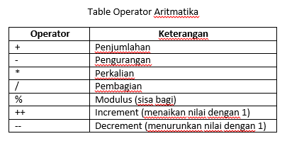
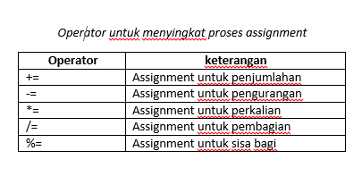
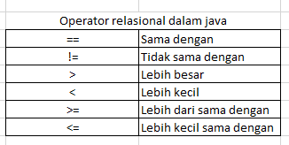
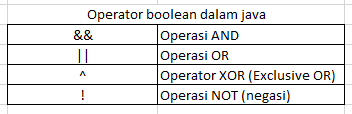
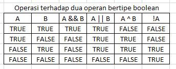

# Chapter 3. Operator

---

Pada chapter ini kita akan membahas
- Operator Aritmatika.
- Operator Relasional.
- Operator logika
- Operator Bitwise

Java merupakan Bahasa pemrograman yang kaya akan operator. Operator-operator tersebut dikelompokan menjadi empat bagian besar, yaitu: operator aritmetika, resional, logika dan bitwise. Pada chapter ini kita akan membahas konsep secara detail dari masing-masing operator yang ada beserta penggunaanya di dalam programnya.

## Operator Aritmatika
Operator aritmatika adalah operator-operator yang digunakan untuk melakukan perhitungan-perhitungan matematis, seperti: penjumlahan, pengurangan, perkalian dan pembagian. Table berikut ini akan menunjukan daftar operator yang termasuk kedalam kelompok operator aritmatika.



*Operand* dari operator aritmatika harus bertipe numerik. Teman-teman tidak dapat menggunakannya untuk tipe data *boolean*. Sebagai pengecualian, untuk tipe *char*, Teman-teman masih dapat melakukan operasi aritmatika karena sebenarnya, atau pada intinya, tipe *char* merupakan *subset* dari tipe *int*.

Berikut ini contoh sebuah operasi aritmatika:
```text
Int a = 2, b = 4;
b = b + a;
```
Operator sama dengan (=) disebut dengan operator *assignment*, yaitu operator yang digunakan untuk memasukan nilai kedalam suatu variable. Pada baris pertama dari kode diatas, kita memasukan nilai 2 ke dalam variable a, dan nilai 4 ke dalam variable b.

Sekarang coba Teman-teman perhatikan baris ke dua dari kode di atas. Kode tersebut berarti bahwa nilai b yang baru adalah nilai b yang lama (4) ditambah dengan nilai a (2), sehingga hasilnya adalah 6. Sama seperti pada Bahasa C/C++, dalam java, bentuk penulisan statemen semacam itu juga dapat disingkat menjadi seperti berikut:
```text
b += a; / /  sama dengan b = b + a
```
Berikut ini tabel yang menunjukan daftar operator penyingkatan dalam java untuk proses assignment atau proses memasukan nilai ke dalam sebuah variable.



Berikut contoh penggunaanya:
```text
b -= a; / /  sama dengan b = b - a
b *= a; / /  sama dengan b = b * a
b /= a; / /  sama dengan b = b / a
b %= a; / /  sama dengan b = b % a
```
### Operator-operator aritmatika dasar.
Operator-operator aritmetika dasar: penjumlahan, pengurangan, perkalian, dan pembagian merupakan operator yang kita butuhkan dalam proses-proses perhitungan numerik pada umumnya. Khusus untuk operator *minus* (-), dapat digunakan juga untuk menegatifkan suatu *operand tnuggal*.

Perlu diperhatikan pula pada saat kita bekerja dengan operator pembagian (/), Apabila kedua *operand* bertipe *integer*, maka hasilnyapun akan berupa *integer*. Namun, apabila salah satu atau kedua *operand*nya bertipe *floating-point*, maka hasil yang akan diperoleh tentu akan berupa *floating-point*.

Berikut ini contoh program yang akan menunjukan penggunaan operator-operator aritmetika dasar, baik untuk tipe *integer* maupun untuk tipe *floating-point*.
```java
public class DemoArikmetikaDasar {
    public static void main(String[] args) {
        System.out.println("Demo Arikmetika Dasar");
        System.out.println("Operator aritmetika pada tipe integer");
        int a = 2 + 1;
        int b = a - 1;
        int c = a * b;
        int d = c / 3;
        int e = -a;
        System.out.println("Nilai a = " + a);
        System.out.println("Nilai b = " + b);
        System.out.println("Nilai c = " + c);
        System.out.println("Nilai d = " + d);
        System.out.println("Nilai e = " + e);


        System.out.println("\nOperator aritmetika pada tipe floating-point");
        double fa = 2 + 1;
        double fb = fa - 1;
        double fc = fa * fb;
        double fd = fc / 3;
        double fe = -fa;
        System.out.println("Nilai fa = " + fa);
        System.out.println("Nilai fb = " + fb);
        System.out.println("Nilai fc = " + fc);
        System.out.println("Nilai fd = " + fd);
        System.out.println("Nilai fe = " + fe);
    }
}
```
Maka hasilnya akan seperti berikut ini:
```
Demo Arikmetika Dasar
Operator aritmetika pada tipe integer
Nilai a = 3
Nilai b = 2
Nilai c = 6
Nilai d = 2
Nilai e = -3

Operator aritmetika pada tipe floating-point
Nilai fa = 3.0
Nilai fb = 2.0
Nilai fc = 6.0
Nilai fd = 2.0
Nilai fe = -3.0
```
### Operator *modulus* (sisa bagi).
Dalam java, operator *modulus* (%) digunakan untuk menentukan sisa bagi dari sebuah operasi pembagian bilangan bulat (*integer*) maupun bilangan rill (*floating-point*). Dalam bahasa C/C++, operator *modulus* hanya dapat diterapkan pada tipe *integer*. Perhatikan contoh kode berikut ini:
```text
int a = 11, b = 4;
int c = a % b;
```
Disini, variabel `c` akan bernilai `3`. Dari mana nilai `3` berasal? Mula-mulanya 11 dibagi 4 akan menghasilkan nilai 2. Selanjutnya, nilai 2 ini dikalikan 4 menghasilkan nilai 8. Dan nilai 3 ini berasal dari 11 dikurangi 8. Dengan kata lain, 3 adalah sisa bagi dari operasi pembagian 11/8.

Sekarang perhatikan kode berikut ini:
```text
double da = 13.75;
int b = 4;
double dc = da % b;
```
Pada kasus ini, variabel dc akan bernilai `1.75` yaitu sisa bagi dari 13.75/4. Dalam bahasa C/C++, statement seperti ini tidak diperbolehkan.

Berikut ini contoh penggunaan operator *modulus* di dalam program java.
```java
public class DemoModulus {
    public static void main(String[] args) {
        System.out.println("Demo Modulus");
        int a = 11, b = 4;
        int c = a % b;

        double da = 13.75;
        double dc = da % b;
        System.out.println("Sisa bagi dari " + a + " / " + b + " = " + c);
        System.out.println("Sisa bagi dari " + da + " / " + b + " = " + dc);
    }
}
```
Maka hasilnya akan seperti ini:
```
Demo Modulus
Sisa bagi dari 11 / 4 = 3
Sisa bagi dari 13.75 / 4 = 1.75
```
### Operator *increment* dan *decrement*.
Sama seperti bahasa C/C++, java juga menyediakan operator *increment* (++) san *decrement* (--), *Increment* digunakan untuk menaikkan nilai *operand* dengan nilai 1, sedangkan *decrement* merupakan kebalikannya, yaitu untuk menurunkan nilai *operand* dengan nilai 1. Sebernarnya, operator-operator ini merupakan bentuk penyingkatan dalam penulisan kode saja. Coba perhatikan kode berikut :
```text
a = a + 1;
```
dapat ditulis dengan operator *increment*, yaitu dengan kode berikut ini:
```text
a++;
```
Adapaun, untuk proses *decrement*:
```text
a = a - 1;
```
dapat ditulis dengan operator *decrement*, yaitu dengan kode berikut ini:
```text
a--;
```
Operator ++ dibedakan lagi menjadi dua jenis, yaitu: *pre-increment* dan *post-increment*. Pada *pre-increment*, operator ++ akan ditulis di depan *operand*, sedangkan untuk *post-increment*, operator ++ akan ditulis dibelakang *operand* (seperti yang baru saja kita tuliskan pada contoh di atas, `a++`). Kedua jenis ini memiliki perilaku yang berbeda. Pada operator *pre-increment*, nilai *operand* akan dinaikkan 1 terlebih dahulu sebelum diproses, sedangkan pada operator *post-increment*, *operand* akan diproses terlebih dahulu sebelum nilainya dinaikkan 1. Untuk lebih jelasnya, coba perhatikan kode berikut ini:

```java
public class DemoIncrement {
    public static void main(String[] args) {
        System.out.println("Demo Increment");
        int a = 5;
        System.out.println("Pre-Increment");
        System.out.println("a \t\t: " + a);
        System.out.println("++a \t: " + ++a);
        System.out.println("a \t\t: " + a);

        int b = 5;
        System.out.println("\nPost-Increment");
        System.out.println("b \t\t: " + b);
        System.out.println("b++ \t: " + b++);
        System.out.println("b \t\t: " + b);
    }
}
```
Maka hasilnya akan seperti ini:
```
Demo Increment
Pre-Increment
a 		: 5
++a 	: 6
a 		: 6

Post-Increment
b 		: 5
b++ 	: 5
b 		: 6
```
Seperti yang terlihat pada output diatas, `++a` berarti menaikan nilai `a` terlebih dahulu sebelum ditampilkan, sedangkan `b++` berarti nilai `b` ditampilkan terlebih dahulu sebelum dinaikan nilainya.

Sama halnya pada operator ++, operator -- juga dibedakan menjadi dua jenis, yaitu: *pre-decrement* dan *post-decrement*. Konsepnya pun sama dengan yang terdapat pada operator ++. Berikut ini contoh program yang akan menunjukan cara kerja dari operator *pre-decrement* dan *post-decrement*.
```java
public class DemoDecrement {
    public static void main(String[] args) {
        System.out.println("Demo Decrement");
        int a = 5;
        System.out.println("Pre-Decrement");
        System.out.println("a \t\t: " + a);
        System.out.println("++a \t: " + --a);
        System.out.println("a \t\t: " + a);

        int b = 5;
        System.out.println("\nPost-Decrement");
        System.out.println("b \t\t: " + b);
        System.out.println("b++ \t: " + b--);
        System.out.println("b \t\t: " + b);
    }
}
```
Maka hasilnya akan seperti berikut ini:
```
Demo Decrement
Pre-Decrement
a 		: 5
++a 	: 4
a 		: 4

Post-Decrement
b 		: 5
b++ 	: 5
b 		: 4
```
## Operator Relasional.
Operator relasional adalah operator yang menyatakan hubungan antara satu *operand* dengan *operand* lainnya. Apakah sama dengan, tidak sama dengan, lebih besar, lebih kecil, lebih kecil sama dengan atau lebih besar sama dengan. Hasil yang diberikan dari operasi yang melibatkan operator relasional akan bernilai *boolean* (*true/false*). Gambar berikut ini menunjukan daftar operator relasional yang terdapat didalam java.


Operator `==` dan `!=` dapat diterapkan ke tipe apapun, baik numerik, karakterm maupun *boolean*. Adapun keempat operator lainnya hanya dapat digunakan untuk tipe numerik dan *char*, untuk mengetahui apakah suatu *operand* lebih besar atau lebih kecil dari *operand* lainnya. Perhatikan contoh berikut:
```text
int a = 5, b = 10;
boolean c = a < b;
```
Disini nilai `c` akan bernilai `true`, karena pada kenyataanya nilai `b` lebih besar dari pada nilai `a`.

Pada umumnya, operator relasional digunakan di dalam ekspresi (baik pada struktur pemilihan `if` maupun `for`).

Teman-teman yang sebelumnya mempelajari bahasa C/C++, kode berikut ini sangatlah umum di dalam bahasa C/C++.
```text
int BENAR = 1;
if(!BENAR) ... TODO // benar di dalam C/C++, tapi salah di dalam JAVA.
// atau
if(BENAR) ... TODO
```
Kode di atas akan berjalan dalam bahasa C/C++, tapi tidak untuk java. Hal ini disebabkan karena dalam bahasa C/C++ tipe *boolean* dapat direpresentasikan dengan tipe *integer*, 0 untuk nilai `false`, dan 1 untuk nilai `true`. Namun, hal ini bukan menjadi pilihan dalam pemograman java. Java tetap membedakan antara tipe *boolean* dan tipe *integer*. Dengan kata lain, java tidak memperbolehkan kita untuk mengkonversi tipe *integer* ke tipe *boolean*, maupun sebaliknya. Berikut ini kode yang seharusnya di tuliskan di dalam java untuk menggantikan kode di atas.
```text
int BENAR = 1;
if(BENAR != 1) ... TODO // code di dalam JAVA.
// atau
if(BENAR == 1) ... TODO
```
Berikut ini contoh kode yang akan menunjukan penggunaan operator relasional di dalam program.
```java
public class DemoRelasional {
    public static void main(String[] args) {
        System.out.println("Demo Relasional");
        int a = 5, b = 10;

        System.out.println("a == b bernilai : " + (a == b));
        System.out.println("a != b bernilai : " + (a != b));
        System.out.println("a > b bernilai : " + (a > b));
        System.out.println("a < b bernilai : " + (a < b));
        System.out.println("a >= b bernilai : " + (a >= b));
        System.out.println("a <= b bernilai : " + (a <= b));
    }
}
```
Maka hasilnya akan seperti berikut:
```
Demo Relasional
a == b bernilai : false
a != b bernilai : true
a > b bernilai : false
a < b bernilai : true
a >= b bernilai : false
a <= b bernilai : true
```
## Operator Logika.
Operator *boolean* digunakan untuk melakukan operasi terhadap dua *operand* yang bersifat *boolean*. Hasil yang diberikan operasi ini juga akan bertipe *boolean*. Berikut ini gambar yang menunjukan *operator boolean*.



Apabila terdapat dua *operand* bernilai *boolean* (misalnya A dan B) dan keduanya digunakan dalam operasi AND, OR, XOR, dan NOT, maka nilai-nilai yang akan dihasilkan sebagai berikut:



Seperti yang tampak pada tabel di atas, operasi AND hanya akan menghasilkan nilai `true` apabila kedua *operand* (A dan B) bernilai `true`. Operan OR hanya akan menghasilkan nilai `false` apabila kedua *operand* bernilai `false`, operasi XOR hanya akan menghasilkan nilai `true` apabila salah satu *operand*-nya bernilai `true`, sedangkan operasi NOT akan menghasilkan negasi atau kebalikan dari nilai sebelumnya.

Berikut ini contoh kode program yang akan menunjukan nilai-nilai yang dihasilkan dari penjelasaan diatas.
```java
public class DemoOperatorLogika {
    public static void main(String[] args) {
        System.out.println("Demo Operator Logika");
        System.out.println("Operasi AND");
        System.out.println("true && true = " + (true && true));
        System.out.println("true && false = " + (true && false));
        System.out.println("false && true = " + (false && true));
        System.out.println("false && false = " + (false && false));

        System.out.println("\nOperasi OR");
        System.out.println("true || true = " + (true || true));
        System.out.println("true || false = " + (true || false));
        System.out.println("false || true = " + (false || true));
        System.out.println("false || false = " + (false || false));

        System.out.println("\nOperasi XOR");
        System.out.println("true ^ true = " + (true ^ true));
        System.out.println("true ^ false = " + (true ^ false));
        System.out.println("false ^ true = " + (false ^ true));
        System.out.println("false * false = " + (false ^ false));

        System.out.println("\nOperasi NOT");
        System.out.println("!true = " + (!true));
        System.out.println("!false = " + (!false));
    }
}
```
Maka hasilnya akan seperti berikut:
```
Demo Operator Logika
Operasi AND
true && true = true
true && false = false
false && true = false
false && false = false

Operasi OR
true || true = true
true || false = true
false || true = true
false || false = false

Operasi XOR
true ^ true = false
true ^ false = true
false ^ true = true
false * false = false

Operasi NOT
!true = false
!false = true
```
## Operator *Bitwise*.
Operator *bitwise* digunakan untuk melakukan operasi *boolean* terhadap dua buah *operand* bertipe *integer*. Operasi ini dilakukan *bit* demi *bit*. Dengan demikian, secara implisit nilai *integer* tersebut akan dikonversi telebih dahulu ke dalam bentuk biner. Dalam operasi ini, nilai `true` direpresentasikan dengan nilai 1 dan `false` dengan nilai 0. Berikut ini daftar operator *bitwise* yang terdapat dalam java.

### Operator *bitwise* AND.
### Operator *bitwise* OR.
### Operator *bitwise* XOR.
### Operator *bitwise* NOT.
### Operator *shift right*.
### Operator *shift right zero fill*.
### Operator *shift left*.
## Operater Tenary ***? :***.
## Prioritas pada Operator.
## Penggunaan tTeman-teman kurung () dalam ekspresi.
[**prev chapter**](../chapter2/README.md) ***<==>*** [**next chapter2**](../chapter4/README.md)

---   
